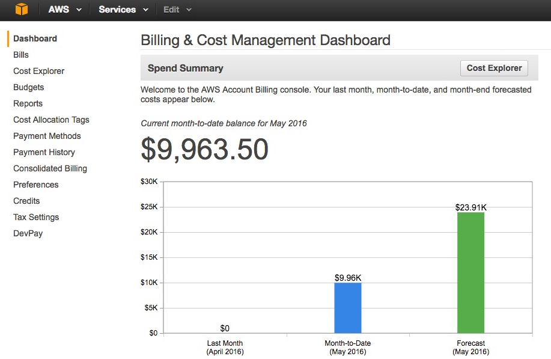

# Manually managing secret keys for Rails apps

**Never EVER check a secret key into git**

**If your key has already been checked in, even if you didn't push; go and revoke that key immediately.**
Hackers can easily scan even OLD commits for keys in minutes.

Don't let this become you:



--

This guide will show you how to add your keys as _environment variables_ in a shell script, then `source` that shell script and use the variables in your Ruby or Node code.

Read on for a full discussion on using secret keys.  Or [click here for the cheatsheet](#tldr-cheatsheet).


## secrets.sh

We're going to store our secret keys in a shell script that will set them as environment variables.  
That shell script will not be checked-in to git and we'll run it before running our server.

> _Environment variables_ are just like regular variables except they live in your terminal.  

> Most programming languages have access to environment variables.  To see a list of your current environment variables type `env` into the terminal.

> Shell scripts allow you to right code in the language your shell or terminal runs; using shell commands.  Usually these are written in the `sh` or `bash` languages.


Let's get started

1. First let's add `secrets.sh` to our `.gitignore` file to prevent us from checking it in.
  Open `.gitignore` and add a line like `secrets.sh`

1. Add and commit the .gitignore file.

  ```sh
  git add .gitignore
  git commit -m "conceal secrets"
  ```
  
1. Now that git will ignore secrets.sh let's create it: `touch secrets.sh` and open it in your editor.  
   Add your secret keys in the following format:

  ```sh
  export MY_KEY_NAME="key value"
  export MY_OTHER_KEY_NAME="other value"
  ```
  
  We can use the same syntax to set environment variables in the terminal itself.


1. Load the variables into the shell.
  In your terminal run: `source secrets.sh`
  * This reads the file into the context of the current terminal session.  
  * You can check the values using `env` or by echoing the variable like `echo $MY_KEY_NAME`
  * **Note: you'll need to run this _once_ for every terminal where you want to run your project; even if you're just running `rake` or `rails c`.**


## Using environment variables in Ruby and Rails
  
Ruby like many programming languages has access to environment variables.  

In Ruby's case they're stored in a Hash called `ENV`.

You can test this out by opening `irb` or `pry` or `rails c` and typing `ENV`.  

> Note: how similar `ENV` is to the terminal command `env`?

In order to use these in Rails you'll have to replace whatever code is using the hard-coded key with the appropriate code to access the environment variable.

For example:

```rb
  # somewhere.rb
    # accessing environment variable stored by `export MY_KEY_NAME="something"`
    api_key = ENV['MY_KEY_NAME']
    other_api_key = ENV['MY_OTHER_KEY_NAME']
    ...
  end
```

Or maybe you're using this in a `yml` file?

```yml
  production: 
    api_key: <%= ENV["MY_KEY_NAME"] %>
```

## Using environment variables in Node

Node also has access to the environment variables of the terminal it is run from.  In node these are stored in an object at `process.env`

To access an environment variable called "`MY_KEY_NAME`", you would:

```js
var apiKey = process.env.MY_KEY_NAME;
```


## Setting the keys on heroku

Since we're not checking our secrets into git, heroku won't know them.  We have to tell heroku manually.

> Try out the command: `heroku help config`

When you're ready to set a key on heroku simply run:

```bash
  heroku config:set MY_KEY_NAME=MY_KEY_VALUE
```


## tldr cheatsheet

##### Setting an environment variable in the shell/terminal (or a shell script):

```sh
export FLICKR_API_KEY=ff333ejfjf
```

##### Accessing an environment variable in ruby

In a ruby file:

```rb
  flickr_api_key = ENV['FLICKR_API_KEY']
```

In a yml file:

```yml
    flickr_api_key: <%= ENV["FLICKR_API_KEY"] %>
```

##### Accessing an environment variable using JavaScript in NodeJS

```js
var flickrApiKey = process.env.FLICKR_API_KEY;
```

##### Setting an environment variable on heroku

```sh
heroku config:set FLICKR_API_KEY=ff333ejfjf
```

##### Sourcing a shell script

This loads environment variables into your current terminal.  Do this before running `node`, `nodemon`, `rails`, `rake` or `ruby`.

```sh
$  source secrets.sh
```

## Remember

When it comes to your secret keys: 


If you ever check one into git, **immediately revoke or change that key** on the website that issued it.
